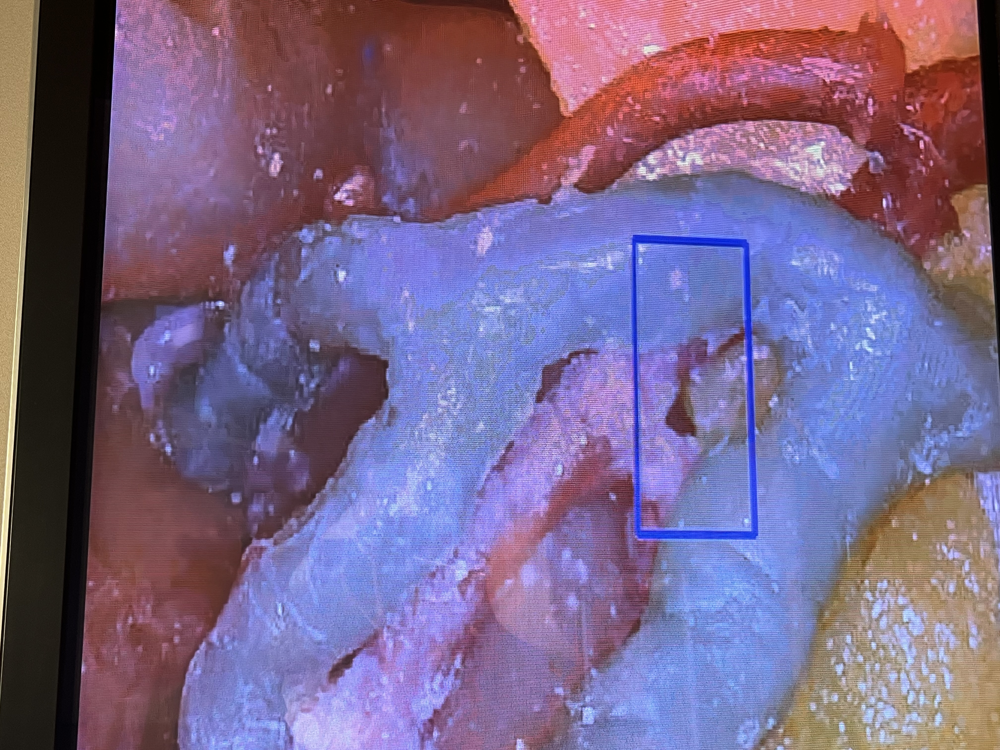

- Program was developed as a component of Laparascopic Surgery Training project (presented at Stanford Wellcome Leap program's annual SAVE (Surgery: assess, validate, expand) conference.

# BACKGROUND
- During laparoscopic cholecystectomy (gallbladder removal), surgeons use **Calot's triangle** as a landmark to identify and dissect the cystic artery and cystic duct. Precise identification and dissection are essential to safely remove the gallbladder without damaging nearby structures like the common bile duct or hepatic artery.
- This program leverages computer vision based techniques such as SURT, SIFT, particle filtering, to detect and track the calot triangle in a human cavity model constructed from real CT scan.

# DEMOS
Pictures taken from live demos at SAVE conference at Stanford University's Goodman Surgical Education Center (January 2024)

